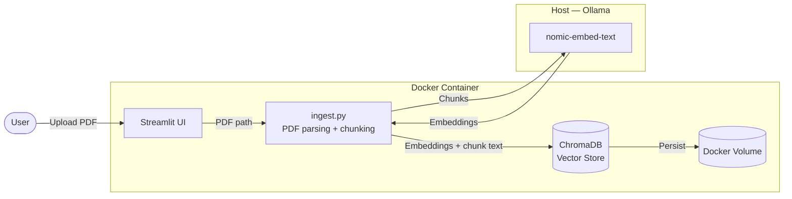
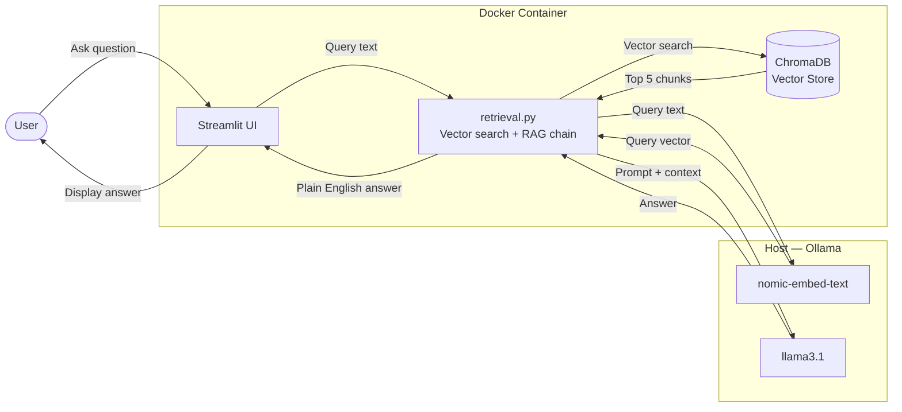

# SceneSage

A locally-running RAG (Retrieval-Augmented Generation) tool for analysing film scripts. Upload a PDF script and ask natural language questions through the Streamlit UI — SceneSage retrieves the most relevant passages and generates a plain English answer using a locally running LLM.

---

## Tech Stack

| Tool | Purpose |
|---|---|
| Python 3.12 | Primary language |
| UV | Package and project management |
| Streamlit | Web UI |
| PyMuPDF (`fitz`) | PDF text extraction |
| ChromaDB | Vector database (in-process, persisted via Docker volume) |
| Ollama — `nomic-embed-text` | Local embeddings model |
| Ollama — `llama3.1` | Local chat LLM |
| httpx | Async HTTP client for Ollama API |
| Docker + Docker Compose | Containerisation |
| pytest + pytest-asyncio + pytest-mock | Unit and integration tests |
| Black | Code formatter |
| GitHub Actions | CI pipeline |
| RAGAS | RAG evaluation (Phase 2) |
| Taskipy | Task runner shortcuts |

---

## Architecture

### ① Ingest Pipeline



### ② Query Pipeline



> **Why Ollama runs natively:** Docker's Linux VM layer on Apple Silicon (M1/M2/M3) prevents GPU access, making local LLM inference unacceptably slow. Ollama runs on the host to access the GPU directly.

> **Why ChromaDB is persisted:** Embeddings are stored in a named Docker volume so re-uploading the same script does not require re-embedding.

---

## Project Layout

```
scenesage/
├── docker-compose.yml
├── pyproject.toml
├── CLAUDE.md
├── .github/
│   └── workflows/
│       └── ci.yml
├── app/
│   ├── Dockerfile
│   └── src/
│       ├── app.py           # Streamlit UI
│       ├── ingest.py        # PDF parsing and embedding
│       └── retrieval.py     # Vector search and RAG chain
├── tests/
│   ├── data/
│   │   └── sample_script.pdf
│   ├── test_ingest.py
│   ├── test_retrieval.py
│   └── e2e/
│       └── test_ui.py
└── data/
    └── scripts/             # Sample PDF scripts (gitignored)
```

---

## How to Run

> Prerequisites: Docker, Ollama installed natively, `nomic-embed-text` and `llama3.1` pulled via Ollama.

```bash
# To be completed when app.py is built
```

---

## How to Test

```bash
# To be completed when taskipy is configured
```

---

## Phase 2 — Evaluation

RAGAS evaluation will be added in Phase 2, measuring:
- **Faithfulness** — does the answer stick to the retrieved context?
- **Answer relevancy** — does the answer address the question?
- **Context precision** — did ChromaDB retrieve useful chunks?
